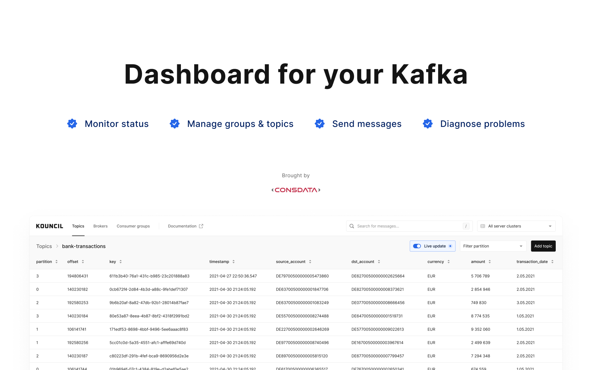

# Kouncil

[](https://travis-ci.com/Consdata/kouncil)
[](https://hub.docker.com/r/consdata/kouncil)

[Kouncil](https://kounci.io) lets you manage your Kafka clusters using convenient web interface. 



During work on our latest messaging system which is based on Kafka, we needed a simple tool for browsing and testing. We went on a search for an easy and free solution, but we didn't find anything that suits our needs. So we came up with our own solution. If your payload is in JSON, you're in the right place. Kouncil lets you 
* check cluster state, 
* monitor consumers lag,
* browse messages in a table format,
* generate messages with auto-filled placeholders.

# 

# Development
For a backend, run KouncilApplication passing parameter ```bootstrapServers=localhost:9092``` pointing to any of your Kafka brokers.

For a frontend, having node and yarn installed, run ```yarn``` and ```yarn start```

For a local Kafka with two test topics, create docker-compose.yml (KAFKA_ADVERTISED_HOST_NAME should match your docker host IP)
```
version: '2'
services:
  zookeeper:
    image: wurstmeister/zookeeper
    ports:
      - "2181:2181"
  kafka:
    image: wurstmeister/kafka
    ports:
      - "9092:9092"
    environment:
      KAFKA_ADVERTISED_HOST_NAME: 192.168.1.76
      KAFKA_ZOOKEEPER_CONNECT: zookeeper:2181
      KAFKA_CREATE_TOPICS: "TestTopic:4:1,TestTopicCompact:4:1:compact"
    volumes:
      - /var/run/docker.sock:/var/run/docker.sock
```

run ```docker-compose up -d```

more info: https://hub.docker.com/r/wurstmeister/kafka/

# Deployment

```
docker run -d -p 80:8080 -e bootstrapServers="CLUSTER_1:9092,CLUSTER_2:8001" consdata/kouncil:latest
```

# Release

To release just push to release branch:
```bash
git push origin master:release
```

after successful release, remember to merge back to master:
```bash
git merge origin/release
```
