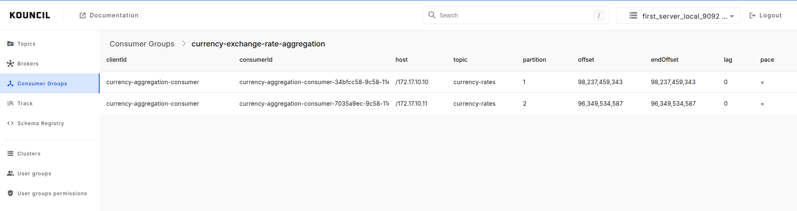

# Features

Here are some of the main features of Kouncil. This list is not exhaustive, check out our [demo app](https://kouncil-demo.web.app/) or [quickly install Kouncil](#quick-start) to experience them first-hand.

## Advanced record browsing in table format

Thanks to Kouncil's convenient way of presenting records in table format even large amounts of complex messages can be easily browsed. You can choose between browsing a single partition or a topic as a whole. If you wish to examine any of the messages more closely you can view its source, copy it to clipboard, or even post it again.

  
  
    &nbsp;&nbsp;&nbsp;&nbsp;
  
  

## Multiple cluster support

If your config spans across multiple Kafka clusters it's no problem for Kouncil. You can switch between them at any time, without having to restart or reconfigure anything.

## Consumer monitoring

Monitoring your consumer groups is one of the most important things when dealing with Kafka. Are my consumers even connected to Kafka? Do they process events? If so, how fast? How long until they finish their workload? Kouncil can help you answer all those questions.

  

## Cluster monitoring

Monitoring your cluster's health can be as important as monitoring your consumer groups. Kouncil shows not only which brokers are currently connected to the cluster, but also their current resource consumption (using Kouncil's [advanced config](#docker---advanced-configuration))

  

## Event Tracking
Event Tracking enables monitoring and visualizing the path of a given event or process by means of Kafka topics.

  

