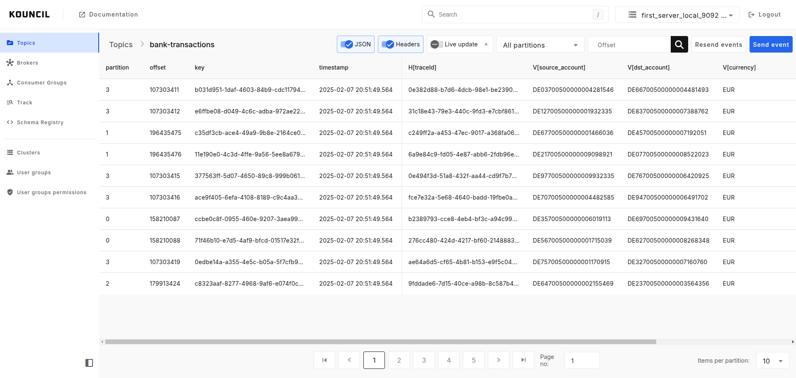
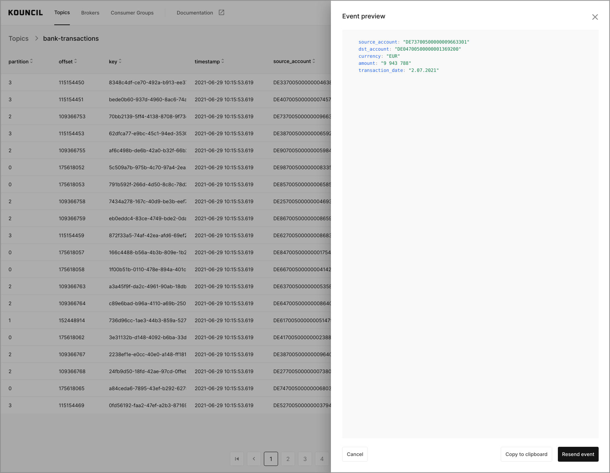
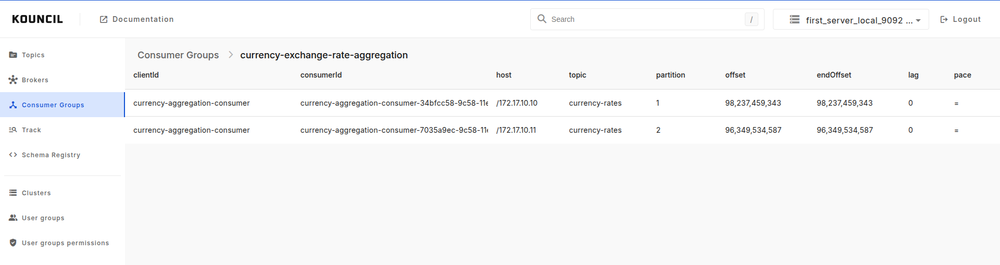
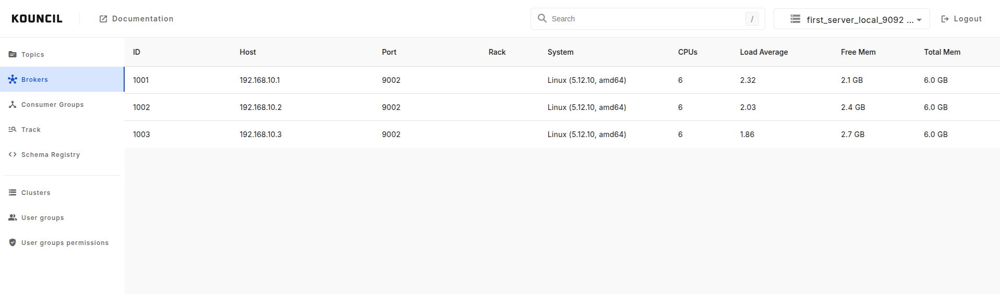
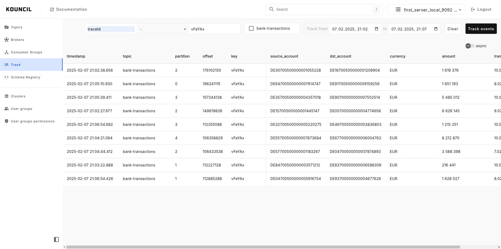

# Kouncil for Apache Kafka

Kouncil lets you monitor and manage your Apache Kafka clusters using a modern web interface. It's free & open source kafka web UI, [feature-rich](#features) and [easy to set up](#quick-start)! This simple kafka tool makes your DATA detectible, helps to troubleshoot problems and deliver optimal solutions. Yoy can easily monitor brokers and their condition, consumer groups and their pace along with the current lag or simply view the content of topics in real time.

Here are some of **the main features of [Kouncil](https://kouncil.io)**. For a more comprehensive list check out the [features section](#features).
* Advanced record browsing in table format
* Multiple cluster support
* Cluster monitoring
* Consumer group monitoring
* Event Tracking

## Table of Contents

- [Quick start](#quick-start)
- [Roadmap](#roadmap)
- [Demo app](#demo-app)
- [Main features](#features)
  - [Advanced record browsing in table format](#advanced-record-browsing-in-table-format)
  - [Multiple cluster support](#multiple-cluster-support)
  - [Consumer monitoring](#consumer-monitoring)
  - [Cluster monitoring](#cluster-monitoring)
  - [Event Tracking](#event-tracking)
- [Deployment](#deployment)
  - [Simple configuration](#docker---simple-configuration)
  - [Advanced configuration](#docker---advanced-configuration)
- [Local Development](#local-development)


## Quick start

The easiest way to start working with Kouncil is by using Docker:

```bash
docker run -d -p 80:8080 -e bootstrapServers="KAFKA_BROKER_HOST:9092" consdata/kouncil:latest
```
There is only one required environment variable, `bootstrapServers`, which should point to one of the brokers in your Kafka cluster. For example, if your cluster consists of three brokers - kafka1.cluster.local, kafka2.cluster.local, kafka3.cluster.local - you only have to specify one of them (`-e bootstrapServers="kafka1.cluster.local:9092"`), and you are good to go, Kouncil will automatically do the rest!

Additionally, Kouncil supports multiple clusters. Hosts specified in `bootstrapServers` may point to brokers in several clusters, and Kouncil will recognize that properly. Brokers should be separated using comma, i.e.: `docker run -d -p 80:8080 -e bootstrapServers="CLUSTER_1:9092,CLUSTER_2:9092" consdata/kouncil:latest`

After the `docker run` command head to [http://localhost](http://localhost).

Images for Kouncil are hosted here: https://hub.docker.com/r/consdata/kouncil.

For more advanced configuration consult the [Deployment](#deployment) section.

## Roadmap

| Version                                                                                                                            | Content                                                                                                                                                                                                                                                                                                                                                              | Status |
|------------------------------------------------------------------------------------------------------------------------------------|----------------------------------------------------------------------------------------------------------------------------------------------------------------------------------------------------------------------------------------------------------------------------------------------------------------------------------------------------------------------|--|
| <b>UI Tweaks Part 1</b>  <br> A handful of fixes based on the most frequently reported comments from our users <br> mid January'21 | <ul> <li> Better logs on broker unavailability <li> Broker config - table improvements </li> <li> Consumer group - Improved lag tracking </li> <li> Consumer group - colour coded </li> <li> Event tracking - date format </li> <li> Event tracking - topic order </li> <li> Event tracking - web socket toggle </li> <li> Tables - Stick it to the left </li> </ul> | Released (1.1) |
| <b> Not Only JSON </b>  <br> This version will bring the remaining popular message formats <br> end March'21                    | <ul> <li> Schema Registry </li> <li> Avro consumer</li> <li> Avro producer</li><li>Protobuf consumer</li><li>Protobuf producer</li><li>Plaintext handling</li> </ul>                                                                                                                                                                                                 | In progress |
| <b> Security </b>  <br> Extended Kafka and Kouncil security support <br> mid April'21                                              | <ul> <li> SSL support</li> <li> JAAS authentication </li> <li> LDAP authentication</li> <li> Logged users activity monitoring</li>  </ul>                                                                                                                                                                                                                                                                      | TODO |
| <b> Cloud </b> <br>Easy way of deploying Kouncil to the cloud<br> end April'21                                                     | <ul> <li>K8s support - helm chart</li>  <li> Terraform (GCP, AWS, Azure) </li> </ul>                                                                                                                                                                                                                                                                                 | TODO |
| <b> UI Tweaks Part 2 </b> <br>Second batch of frontend improvements<br>end May'21                                                | <ul> <li>Broker list - overview</li> <li>Event tracking - additional columns </li>  <li>Tables - column auto adjustment </li>  <li>Consumer Group - Lag preview </li>  </li>                                                                                                                                                                                         | TODO |


## Demo app

If you wish to simply check out Kouncil in action, without having to install it, we've prepared a demo site showcasing the main features of Kouncil. The demo site can be found [here](https://kouncil-demo.web.app/)

## Features

Here are some of the main features of Kouncil. This list is not exhaustive, check out our [demo app](https://kouncil-demo.web.app/) or [quickly install Kouncil](#quick-start) to experience them first-hand.

### Advanced record browsing in table format

Thanks to Kouncil's convenient way of presenting records in table format even large amounts of complex messages can be easily browsed. You can choose between browsing a single partition or a topic as a whole. If you wish to examine any of the messages more closely you can view its source, copy it to clipboard, or even post it again.

<p align="left">
  
  <span>
    &nbsp;&nbsp;&nbsp;&nbsp;
  </span>
  
</p>

### Multiple cluster support

If your config spans across multiple Kafka clusters it's no problem for Kouncil. You can switch between them at any time, without having to restart or reconfigure anything.

### Consumer monitoring

Monitoring your consumer groups is one of the most important things when dealing with Kafka. Are my consumers even connected to Kafka? Do they process events? If so, how fast? How long until they finish their workload? Kouncil can help you answer all those questions.

<p align="left">
  
</p>


### Cluster monitoring

Monitoring your cluster's health can be as important as monitoring your consumer groups. Kouncil shows not only which brokers are currently connected to the cluster, but also their current resource consumption (using Kouncil's [advanced config](#docker---advanced-configuration))

<p align="left">
  
</p>

### Event Tracking
Event Tracking enables monitoring and visualizing the path of a given event or process by means of Kafka topics.

<p align="left">
  
</p>

## Deployment

There are two ways in which Kouncil can be configured:
* simple - suitable for most cases, relying solely on `docker run` parameters
* advanced - suitable for larger configurations. Provided as an external file, and thus can be tracked in version control. It also exposes additional configuration options, which are not available in the simple configuration

### Docker - simple configuration

Simple configuration is passed directly into `docker run` command using `bootstrapServers` environment variable, just as we've seen in [Quick start](#quick-start):

```bash
docker run -d -p 80:8080 -e bootstrapServers="KAFKA_BROKER_HOST:9092" consdata/kouncil:latest
```

`bootstrapServers` variable expects a comma-separated list of brokers, each belonging to a different cluster. Kouncil only needs to know about a single broker from the cluster in order to work.

The simplest possible configuration looks like this:

```bash
docker run -d -p 80:8080 -e bootstrapServers="kafka1.cluster.local:9092" consdata/kouncil:latest
```

After that, visit [http://localhost](http://localhost) in your browser, and you should be greeted with a list of topics from your cluster.

If you have multiple clusters and wish to manage them all with Kouncil, you can do so by simply specifying one broker from each cluster using comma-separated list:

```bash
docker run -d -p 80:8080 -e bootstrapServers="kafka1.cluster.local:9092,kafka1.another.cluster:8001" consdata/kouncil:latest
```

If you want to set Schema Registry url use `schemaRegistryUrl` environment variable, for instance:
```bash
docker run -d -p 80:8080 -e bootstrapServers="kafka1.cluster.local:9092" -e schemaRegistryUrl="http://schema.registry:8081" consdata/kouncil:latest
```
This url will be used for every cluster in `boostrapServers` variable. If you want to be more specific go to [Advanced configuration](#docker---advanced-configuration).

In order to change the port on which Kouncil listens for connections, just modify the `-p` argument, like so:

```bash
docker run -d -p 7070:8080 -e bootstrapServers="kafka1.cluster.local:9092" consdata/kouncil:latest
```

That will cause Kouncil to listen on port `7070`.

### Docker - advanced configuration

If you have many Kafka clusters, configuring them using `bootstrapServers` may become cumbersome. It is also impossible to express more sophisticated configuration options using such a simple configuration pattern.

To address these issues Kouncil allows you to provide an external configuration in a yaml file.

Kouncil expects this configuration file to be named `kouncil.yaml`. After that it's only a matter of binding a directory containing that file into docker - let's say your `kouncil.yaml` lives in `/home/users/test/Kouncil/config/`, that's how your `docker run` should look:

```bash
docker run -p 80:8080 -v /home/users/test/Kouncil/config/:/config/ consdata/kouncil:latest
```

Format of `kouncil.yaml` is described below.

#### Advanced config example

```yaml
kouncil:
  clusters:
    - name: transaction-cluster
      schemaRegistry:
        url: "http://schema.registry:8081"
      brokers:
        - host: 192.10.0.1
          port: 9092
        - host: 192.10.0.2
          port: 9093
        - host: 192.10.0.3
          port: 9094
    - name: kouncil
      schemaRegistry:
        url: "http://another.schema.registry:8081"
      brokers:
        - host: kouncil.kafka.local
          port: 8001
        - host: kouncil.kafka.local
          port: 8002
```
This example shows two clusters, named `transaction-cluster` and `kouncil` respectively. Each cluster needs to have its name specified. After that comes a list of brokers that make up this cluster - each of which consisting of the broker's host and port on which it's listening on.

#### Advanced config - JMX monitoring

If your Kafka brokers expose JMX metrics Kouncil can take advantage of that, displaying additional metrics. This is done using advanced config, where you can specify JMX parameters for each broker, like so:

```yaml
kouncil:
  clusters:
    - name: transaction-cluster
      brokers:
        - host: 192.10.0.1
          port: 9092
          jmxPort: 5088
        - host: 192.10.0.2
          port: 9093
          jmxPort: 5089
        - host: 192.10.0.3
          port: 9094
          jmxPort: 5090
```
This example assumes that broker does not require any kind of authentication to access JMX metrics - you only need to specify JMX port. If that's not the case, and JMX authentication is turned on, you can also specify JMX user and password:

```yaml
kouncil:
  clusters:
    - name: transaction-cluster
      brokers:
        - host: 192.10.0.1
          port: 9092
          jmxPort: 5088
          jmxUser: jmxAdmin
          jmxPassword: jmxPassword
        - host: 192.10.0.2
          port: 9093
          jmxPort: 5088
          jmxUser: jmxAdmin
          jmxPassword: jmxPassword
        - host: 192.10.0.3
          port: 9094
          jmxPort: 5088
          jmxUser: jmxAdmin
          jmxPassword: jmxPassword
```
It quickly becomes clear, that in many cases those properties (`jmxPort`, `jmxUser`, `jmxPassword`) will be identical for each of the brokers inside the cluster. For that reason, you can also specify them on a cluster level, and they will propagate to each broker:

```yaml
kouncil:
  clusters:
    - name: transaction-cluster
      jmxPort: 5088
      jmxUser: jmxAdmin
      jmxPassword: jmxPassword
      brokers:
        - host: 192.10.0.1
          port: 9092    
        - host: 192.10.0.2
          port: 9093
        - host: 192.10.0.3
          port: 9094
```
All brokers inside `transaction-cluster` will share the same JMX configuration (`jmxPort` = `5088`, `jmxUser` = `jmxAdmin`, `jmxPassword` = `jmxPassword`).

Propagation of JMX parameters works independently for each of those parameters. For example, each of the brokers may have the same JMX user and password, but different port:

```yaml
kouncil:
  clusters:
    - name: transaction-cluster
      jmxUser: jmxAdmin
      jmxPassword: jmxPassword
      brokers:
        - host: 192.10.0.1
          port: 9092
          jmxPort: 5088
        - host: 192.10.0.2
          port: 9093
          jmxPort: 5089
        - host: 192.10.0.3
          port: 9094
          jmxPort: 5090
```

In the case of both simple and advanced configuration being present, the advanced configuration takes precedence.

### WebSocket allowed origins configuration
By default, WebSocket allowed origins are set to *, which can be inefficient from the security point of view. You can easily narrow it down, setting `allowedOrigins` environment variable like that: 

```docker run -d -p 80:8080 -e bootstrapServers="KAFKA_BROKER_HOST:9092" -e allowedOrigins="http://localhost:*, https://yourdomain.com" consdata/kouncil:latest```


## Local Development
For the backend, run KouncilApplication passing parameter ```bootstrapServers=localhost:9092``` pointing to any of your Kafka brokers.

For the frontend, having node and yarn installed, run ```yarn``` and ```yarn start```

For the local Kafka with two test topics, create docker-compose.yml (KAFKA_ADVERTISED_HOST_NAME should match your docker host IP)
```yaml
version: '2'
services:
  zookeeper:
    image: wurstmeister/zookeeper
    ports:
      - "2181:2181"
  kafka:
    image: wurstmeister/kafka
    ports:
      - "9092:9092"
    environment:
      KAFKA_ADVERTISED_HOST_NAME: 192.168.1.76
      KAFKA_ZOOKEEPER_CONNECT: zookeeper:2181
      KAFKA_CREATE_TOPICS: "TestTopic:4:1,TestTopicCompact:4:1:compact"
    volumes:
      - /var/run/docker.sock:/var/run/docker.sock
```

run ```docker-compose up -d```

more info: https://hub.docker.com/r/wurstmeister/kafka/


# Release

To release just push to release branch:
```bash
git push origin master:release
```

after a successful release, remember to merge back to master:
```bash
git merge origin/release
```
