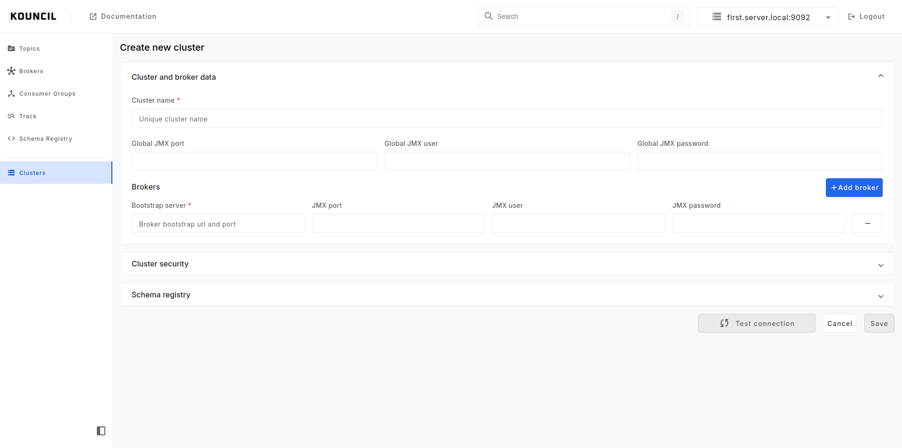
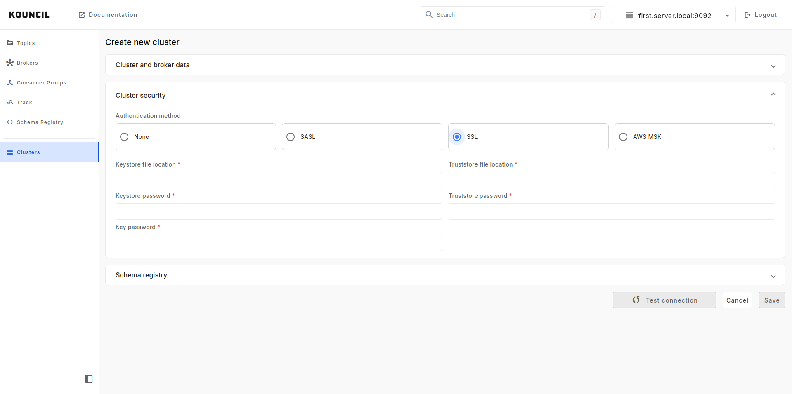
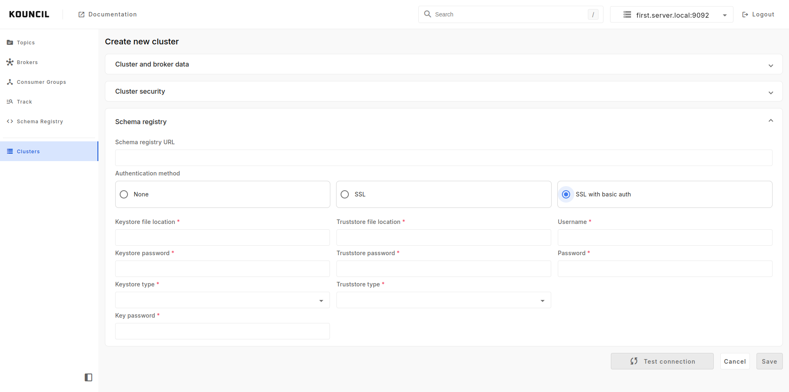

## Managing Kafka clusters

Starting from version 1.9 you will be able to configure and secure your Kafka clusters from UI. To
do it log in to the app and select Clusters menu item. You will see your clusters list. To add new
cluster click `Add new cluster` button and cluster form will be opened.

    

### Cluster SSL/TLS configuration

If your Kafka cluster requires any authentication you are able to configure `SASL`, `SSL`
or `AWS MSK` authentication.

    

### Schema registry

Within this form you are able to add Schema Registry to your cluster.

    

If your Schema Registry requires any authentication you are able to configure `SSL`
or `SSL with basic authentication` security.
