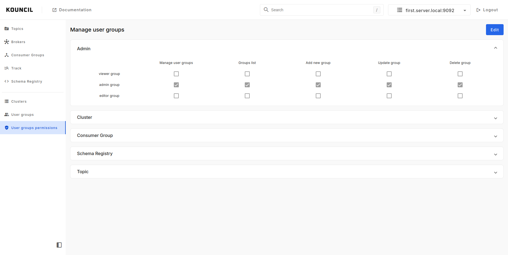
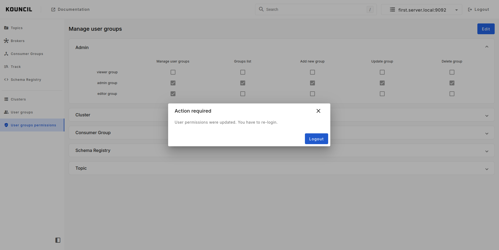

## Authorization


**WARNING**

This configuration will be deprecated in version 1.9 and removed in the future. In version 1.9 this
configuration will be used to preload user groups and based on that create permissions for each
group.


Kouncil allows to restrict access to pages and functions for users. To achieve that you should add
to you configuration file appropriate properties.
There are three of
them, `kouncil.authorization.role-admin`, `kouncil.authorization.role-editor`, `kouncil.authorization.role-viewer`.
Each one of this will allow user to do specific actions in Kouncil. Users with roles assigned to:

* `kouncil.authorization.role-admin` can view brokers and consumer groups pages.
* `kouncil.authorization.role-editor` can view topics, event tracker pages and sent messages to
  topics.
* `kouncil.authorization.role-viewer` can only view topics and event tracker pages.

As a values in these parameters you should provide semicolon (`;`) separated list of groups defined
in selected authentication provider (`inmemory`, `LDAP`, `AD`, `SSO`).

For the default configuration, we have defined user groups:

```yaml
kouncil:
  authorization:
    role-admin: admin_group
    role-editor: editor_group
    role-viewer: viewer_group
```

These will be used in any authentication method unless you override them in any of your
configuration files, which are used by Kouncil.

Example roles configuration:

```yaml
kouncil:
  authorization:
    role-admin: KOUNCIL_ADMIN;ROLE_USER;admin_group
    role-editor: KOUNCIL_EDITOR;editor_group
    role-viewer: KOUNCIL_VIEWER;viewer_group
```

To get LDAP user groups in LDAP configuration we have to add few additional
parameters (`group-search-base`, `group-search-filter`, `group-role-attribute`)

```yaml
kouncil:
  auth:
    active-provider: ldap
    ldap:
      provider-url: "ldaps://kouncil.io"
      technical-user-name: "admin@kouncil.io"
      technical-user-password: "q1w2e3r4"
      search-base: "ou=Users,dc=kouncil,dc=io"
      search-filter: "(&(objectClass=user)(uid={0})(memberOf=CN=KOUNCIL,CN=Users,DC=kouncil,DC=io))"
      group-search-base: "ou=Groups,dc=kouncil,dc=io"
      group-search-filter: "(memberuid={0})"
      group-role-attribute: "cn"
```

### Configuration

Since version 1.9 configuration of user groups and user groups permissions is available from UI.

<p align="left">
    
</p>

When permissions will change users will see the message that re-login is required.

<p align="left">
    
</p>

By default, users with groups assigned to `kouncil.authorization.role-admin` will
be able to manage user groups and user groups permissions.


