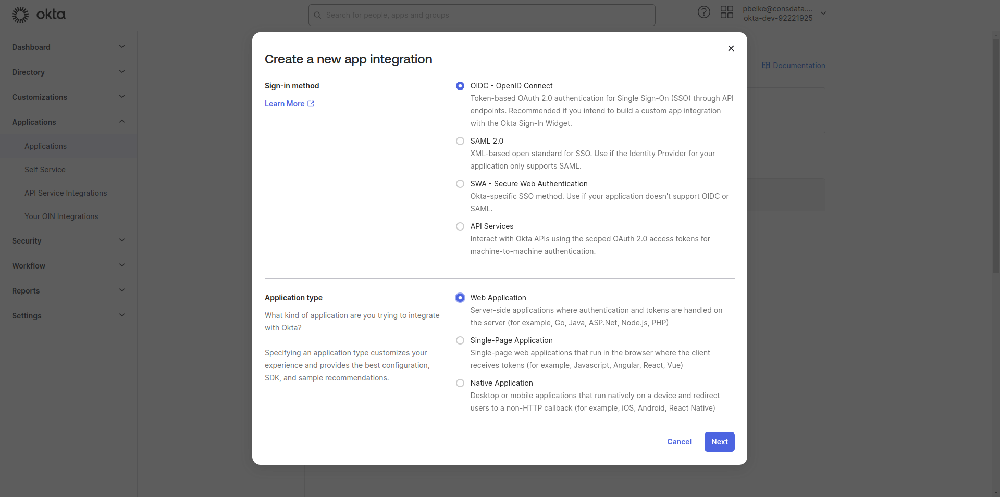
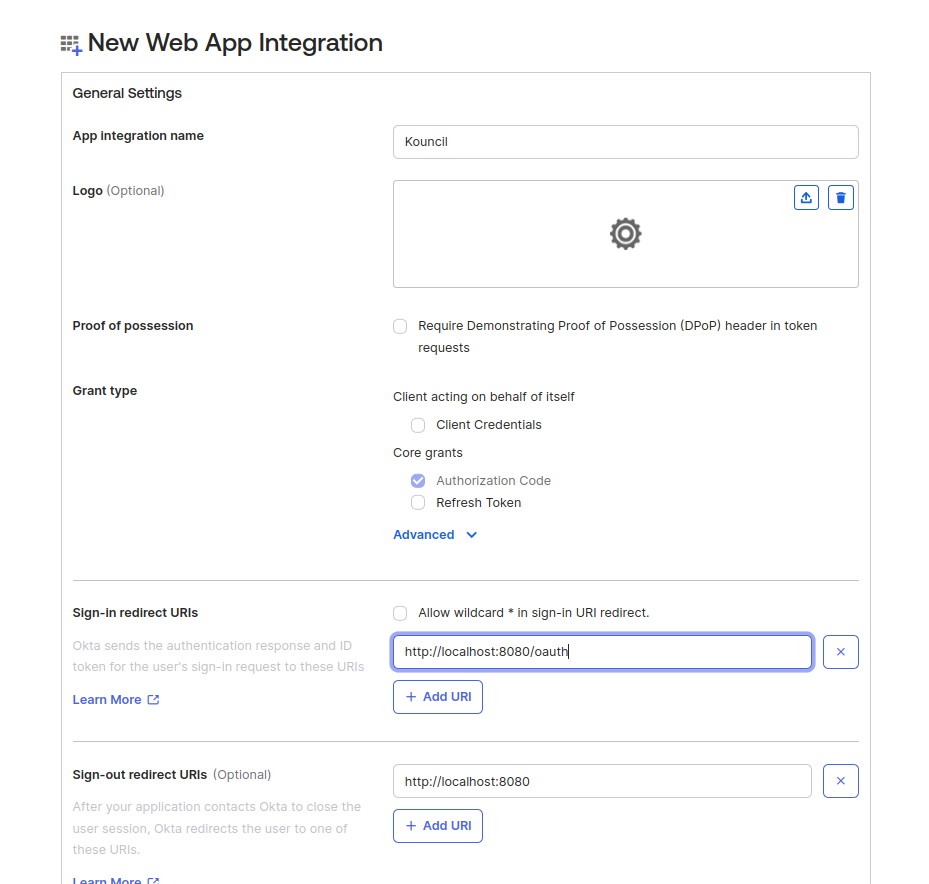
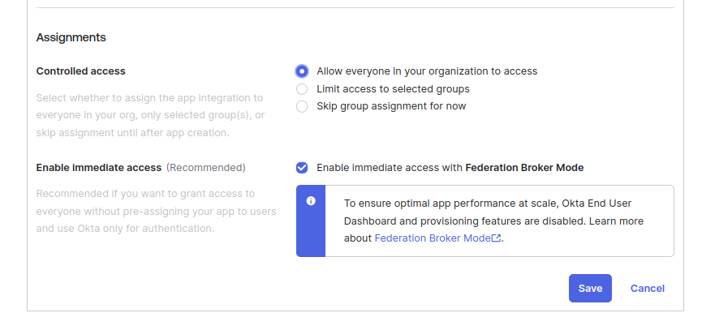
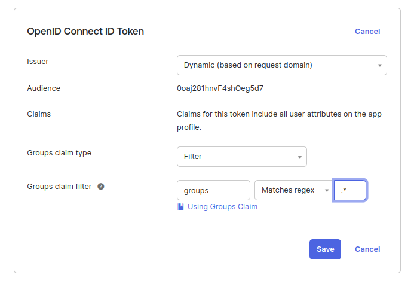

## Okta SSO configuration

### Okta configuration

In Okta, you have to create a new Web application with `OIDC - OpenID Connect` Sign-in method:
<p align="left">
    
</p>

In the next step you have to configure callback URI, which should look like this:
`http://<your-application-url>/oauth`

<p align="left">
    
</p>

Before saving configuration you have to configure application assignments.

<p align="left">
    
</p>

In the last step if you should configure groups claim filter to get user groups with access token.
You can use any of the compare methods, `Equals`, `Matches regex`, etc. which will match your
requirements and Okta groups configuration.

<p align="left">
    
</p>

### Kouncil configuration

In Kouncil you can configure Okta SSO by adding below snippet to your configuration file. You have
to replace `your-client-id`, `your-client-secret`, `your-application-url`
and `your-domain-id`

```yaml
kouncil:
  auth:
    active-provider: sso
    sso:
      supported:
        providers: okta
spring:
  security:
    oauth2:
      client:
        registration:
          okta:
            client-id: <your-client-id>
            client-secret: <your-client-secret>
            redirect-uri: http://<your-application-url>/oauth
            scope: openid,profile,email,groups
        provider:
          okta:
            authorization-uri: https://<your-domain-id>/oauth2/v1/authorize
            token-uri: https://<your-domain-id>/oauth2/v1/token
            user-info-uri: https://<your-domain-id>/oauth2/v1/userinfo
            jwk-set-uri: https://<your-domain-id>/oauth2/v1/keys 
```
