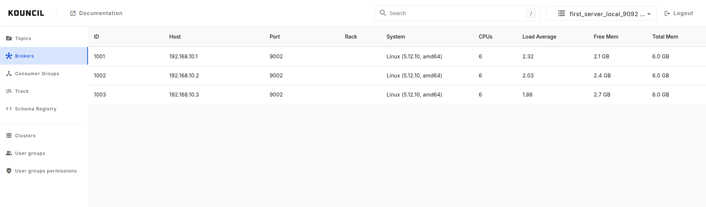

# Clusters

Kouncil allows you to manage and monitor you clusters.

If you want to know how to add new cluster with schema registry head to [cluster configuration](../configuration/KAFKA_CLUSTER.md).  

## Multiple cluster support

If your config spans across multiple Kafka clusters, it's not a problem for Kouncil. You can switch
between clusters at any time, without having to restart or reconfigure anything.

## Cluster monitoring

Monitoring your cluster's health can be as important as monitoring your brokers.
Kouncil shows the brokers that are currently connected to the cluster and their current resource
consumption (using Kouncil's [advanced config](installation/DEPLOYMENT.md#docker---advanced-configuration))

  

