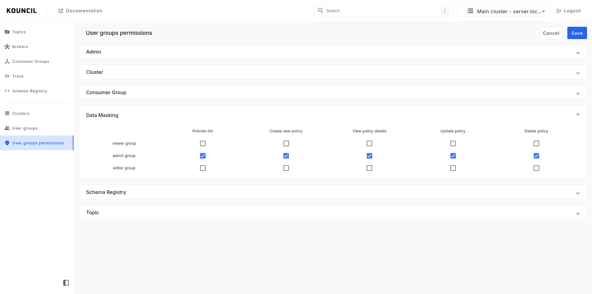
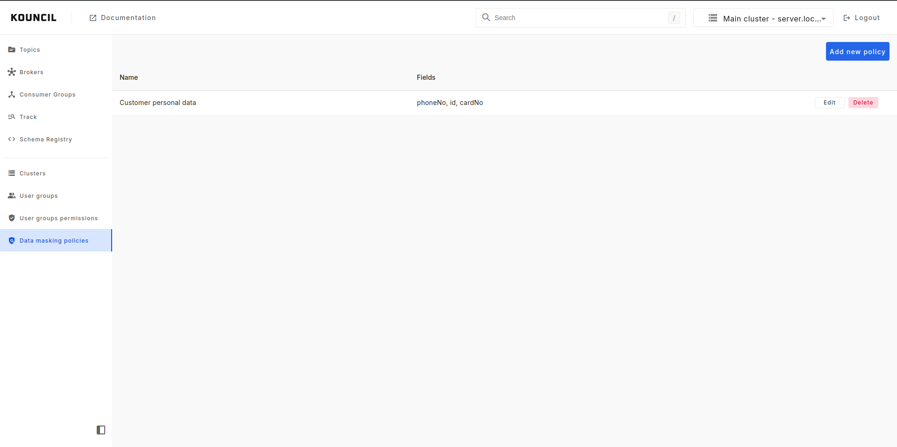
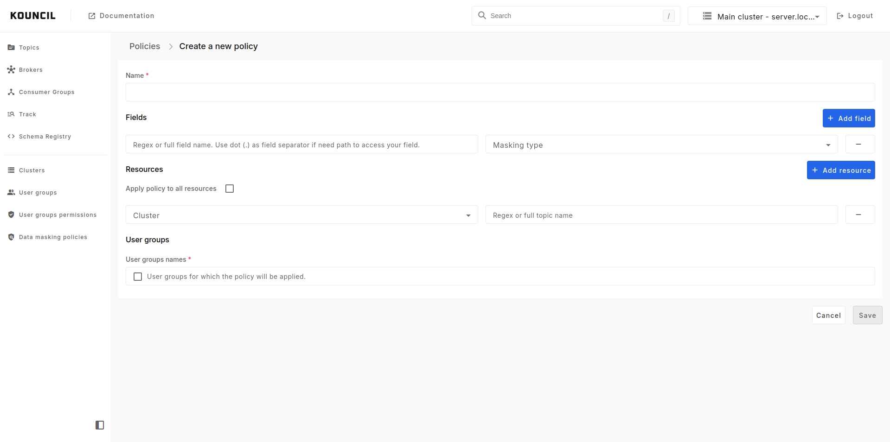
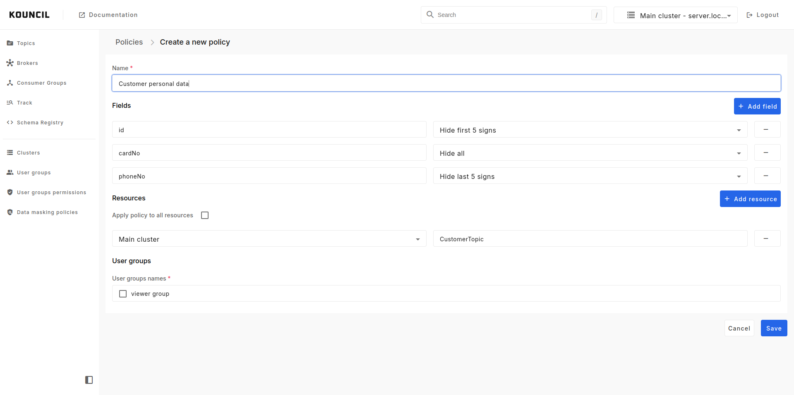
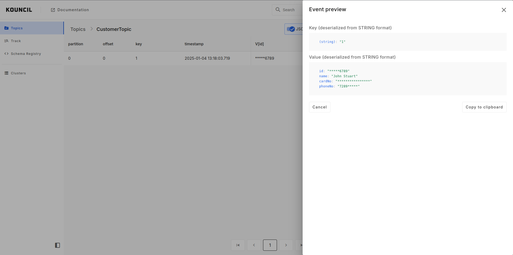
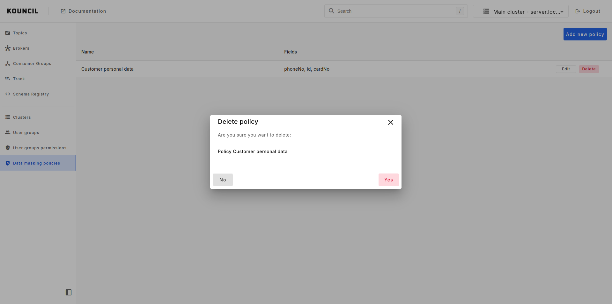

## Data masking

Some of the messages in topics might contain personal and sensitive data. To secure this kind of
information we added new feature, data masking.

To turn on this feature, you will have to modify user groups permissions as shown on the screen
below:

  

In that case users with `admin_group` will have access to view, create, modify and remove data
masking policies.

### List of policies

To view list of all defined policies you should pick **Data masking policies** from the menu.

  

### Add new policy

To create new policy you will have to click Add new policy button on the policies list screen. Then
you will see create new policy form.

  

In that form you will have to provide:

* name - policy name
* fields - list of fields names and masking type for each of them
* resources - clusters and topics
    * list of selected clusters and topics names (as topic names you can provide any valid regex)
      for which policy will be applied
    * or, if you want, you can apply policy to all resources by ticking the checkbox below resources
      label
* user groups - list of user groups for which policy will be applied

  

### Applying policy

Policies will be applied automatically. When you log in as a user with user group defined in the
policy, topic messages for selected resource will have masked data. For masking, star sign, `*`,
will be used.

If we follow above defined policy you should not be able to see all information in CustomerTopic.

  

### Remove policy

Of course if you no longer need the policy you can remove it. To do it, navigate to policies list
and click **Delete** button in the row of the policy you want to remove.

  

