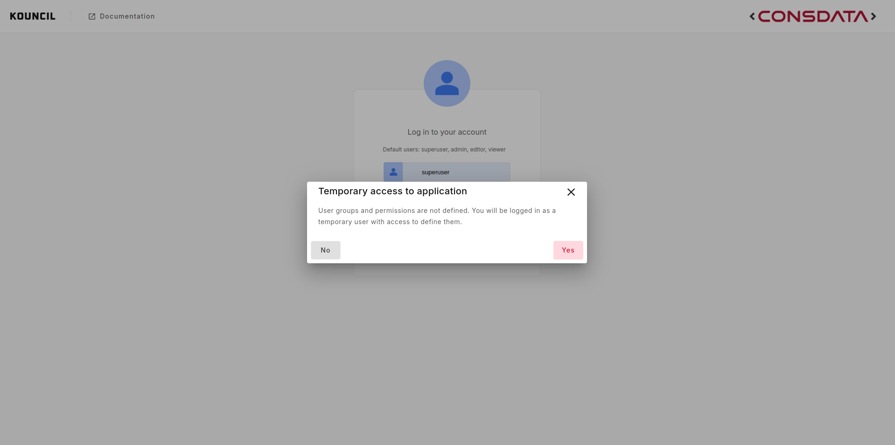
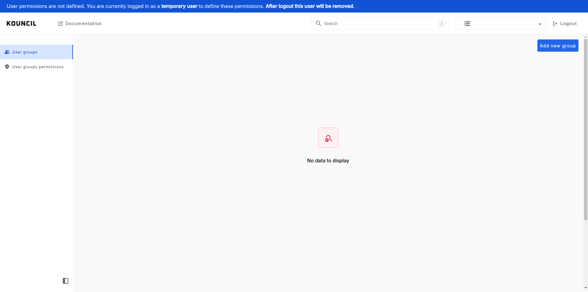

# Onboarding

When you launch Kouncil and no user groups and permissions are defined you will
see popup which will inform you that you will be logged in as temporary user to define them.

  

After logging in you will see banner at the top of the page which will have information that you are
logged in as temporary user.

  

After saving user groups permissions, temporary user will not be logged out. This will happen only
if you manually click logout button. This is done so you can verify, that you defined groups and
permissions correctly. After manual logout temporary user will be removed. And you will be able
to log in with:
* predefined users (admin, editor, viewer, superuser) in inmemory authentication 
* real users for other authentication methods, ldap, ad, sso.


**INFO**

For **inmemory** authentication groups and permissions will be preloaded.

