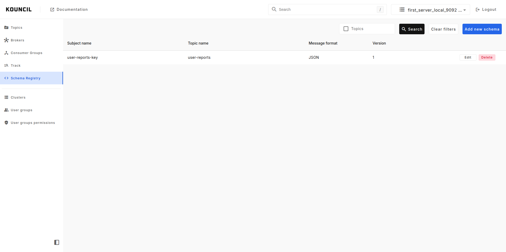
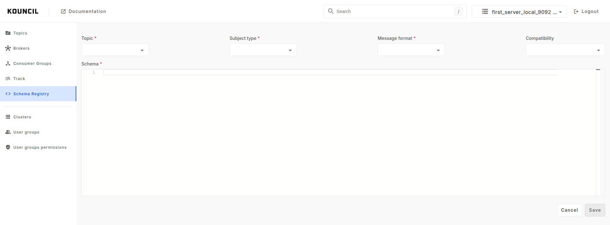

# Schema registry

Kouncil allows you to create and manage subjects and schemas for connected to your cluster Schema
Registry. If you cluster topic have a Schema Registry, you can be sure that messages which will come
to it will have the same structure.

  

Schema Registry can be added to per cluster. If you want to know how to do it, please check [Clusters](CLUSTERS.md)
feature page.

## Create new schema

So if you have Schema Registry added to your cluster to add new schema go to Schema Registry menu.
You will see list of registered schemas for currently selected cluster. Next click **Add new schema
** button which will open a new form to register new schema.

  

In this form you can:

* select for which registered topic in currently selected cluster,
* decided for which part of the message key or value,
* select in format you will provide your schema,
* decide how the schema should react on future updates (compatibility)

schema should be registered

## Schema formats

Kouncil supports the Avro, JSON, and Protobuf formats for Schema Registry.

## Schema compatibility

Each Subject has a compatibility type that determines how they should deal with schema changes over
time. Updating a schema can cause issues upstream or downstream on applications, and choosing the
right compatibility type can prevent this from occurring.

There are 7 compatibility types:

* Backward
* Backward Transitive
* Forward
* Forward Transitive
* Full
* Full Transitive
* None

If you want to know what each type mean please
check [Schema Registry docs](https://docs.confluent.io/platform/current/schema-registry/fundamentals/schema-evolution.html#summary).

## Delete schema

In the list screen you are able to delete schema, by clicking **Delete** button at the end of the
schema row. This will only remove the current version of the schema.
