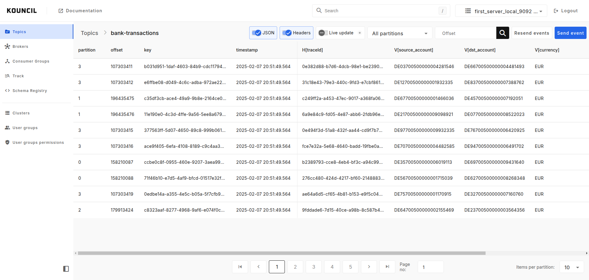
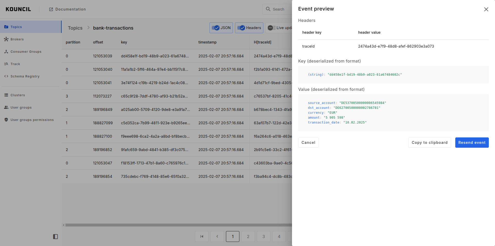

# Manage topics and browsing topic messages

Kouncil allows you to manage topics in your Kafka cluster, browse topics messages and check the path
which message passed across the Kafka topics.

## Topic list

If you have permission to this screen, topics list will be the first thing you will see after login
in. On this screen you will see list of topics for selected cluster. You will be able to create,
change and delete topics.

  

## Advanced record browsing in table format

Thanks to Kouncil's convenient way of presenting records in a table format, even large amounts of
complex messages can be easily browsed. You can choose between browsing a single partition or a
topic as a whole. If you wish to examine any of the messages more closely, you can view its source,
copy it to a clipboard, or even post it again.

  
  
    &nbsp;&nbsp;&nbsp;&nbsp;
  
  

## Event tracking

Event tracking enables monitoring and visualizing the path of a given event or process across the
Kafka topics.

  

