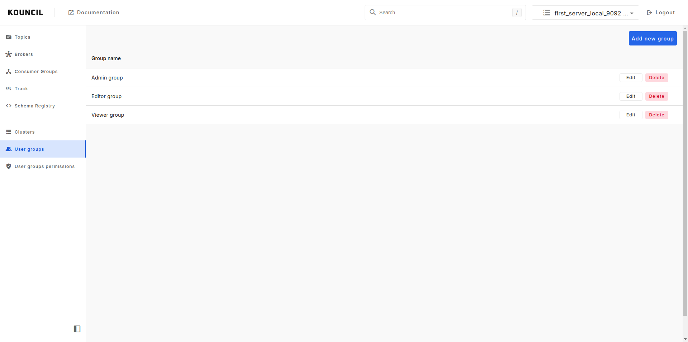
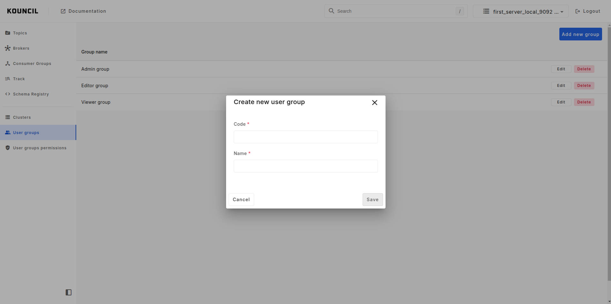
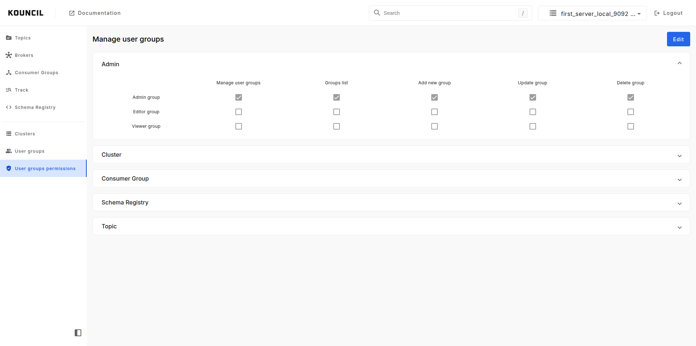

# User groups and permissions

Kouncil's access control is based on roles (RBAC). It allows you to restrict access based on roles
which logged-in user has assigned.

## Managing user groups

First you have to add groups which will match groups from your selected authentication type (
inmemory, ldap, ad, sso). To do it navigate to User groups and click **Add new group** button.


**INFO**

In **inmemory** authentication users has predefined groups, **admin_group**, **editor_group** and
**viewer_group**.


  

In this form provide group code and name. Remember that code should be unique.

  

## Managing permissions for groups

For managing user groups permissions navigate to menu with that name.

You will see a thematically grouped list of functionalities, and you will be able to define which
group has access to which function in the system.

  

